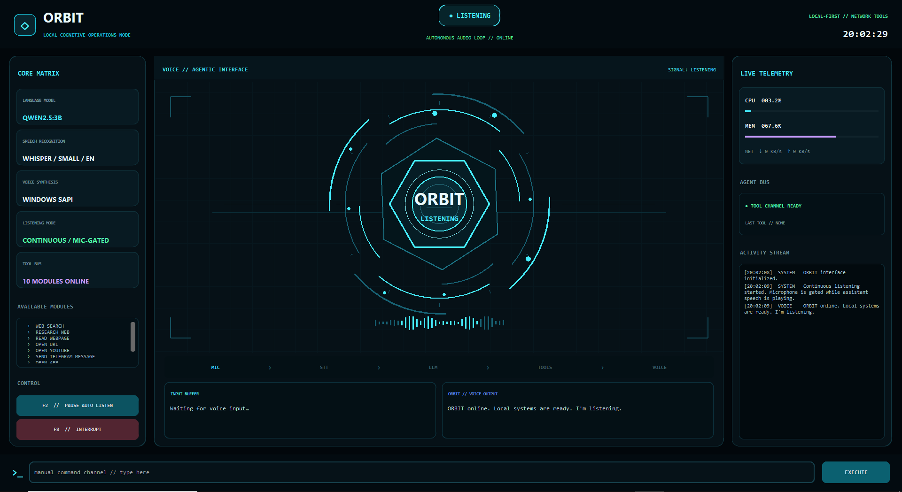
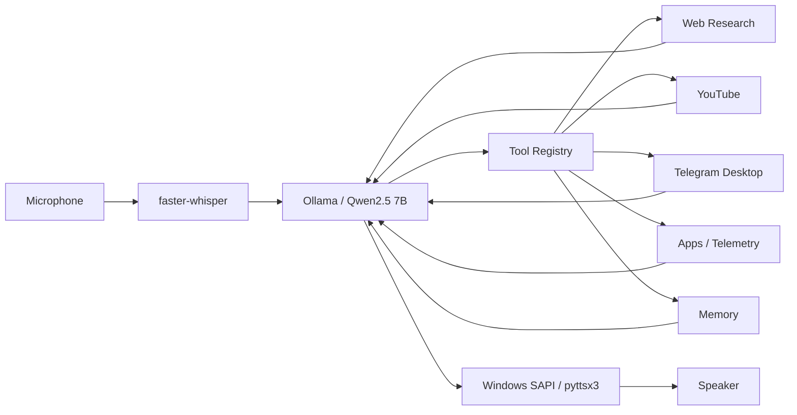

# ORBIT — Local AI Voice Agent

<p align="center">
  <strong>A local-first, voice-driven AI agent built with Python, faster-whisper, Ollama/Qwen, tool calling, desktop automation, local memory, and an animated real-time HUD.</strong>
</p>

<p align="center">
  <a href="README.fa.md">فارسی</a>
  ·
  <a href="#quick-start">Quick Start</a>
  ·
  <a href="docs/ARCHITECTURE.md">Architecture</a>
  ·
  <a href="docs/DEMO_COMMANDS.md">Demo Commands</a>
  ·
  <a href="docs/TROUBLESHOOTING.md">Troubleshooting</a>
  ·
  <a href="docs/PRIVACY.md">Privacy</a>
  ·
  <a href="ROADMAP.md">Roadmap</a>
</p>

<p align="center">
  <a href="https://github.com/mostafa-kermaninia/Orbit-Local-AI-Agent/actions/workflows/ci.yml">
    
  </a>
  
  
  <a href="LICENSE"></a>
  
</p>

<p align="center">
  
</p>

> **Course companion project** for **«آموزش پروژه‌محور پردازش صوت و گفتار با پایتون»**  
> Created and maintained by **Mostafa Kermaninia**.

---


## What ORBIT does

ORBIT combines the major components of a modern voice-agent stack into one inspectable Python project:

```text
Microphone
   ↓
faster-whisper
Speech-to-Text
   ↓
Ollama + Qwen2.5 7B
Local reasoning + tool selection
   ↓
Tool Registry
   ├── Visible web search / multi-source research
   ├── Read a public webpage
   ├── YouTube
   ├── Telegram Desktop automation
   ├── Safe app launcher
   ├── System telemetry
   └── Local long-term memory
   ↓
Windows SAPI / pyttsx3
Text-to-Speech
   ↓
Speaker
```

The default interaction mode is **hands-free half-duplex**: ORBIT automatically listens after each response, while the microphone is gated during TTS so the assistant does not hear its own speaker output.

## Highlights

- **Local speech recognition** with `faster-whisper`
- **Local LLM inference** through Ollama
- **Natural-language tool calling**
- **Continuous hands-free listening**
- **Mic-gated half-duplex audio** for reliable desktop demos
- **Spoken success/failure feedback** after actions
- **Visible multi-source web research**: search results and source tabs are opened in the user's browser while content is extracted for synthesis
- **Specific webpage reading and summarization**
- **YouTube search / first-result opening**
- **Telegram Desktop automation** using the user's already logged-in desktop session
- **Unicode-safe clipboard paste**, including Persian text
- **Safe application launcher** using an explicit alias allowlist
- **CPU/RAM/network telemetry**
- **Explicit local long-term memory**
- **Procedural HUD** drawn with CustomTkinter/Tk Canvas; no external HUD artwork is required

## Architecture



For the detailed data flow, state machine, tool boundary, and reliability decisions, see [docs/ARCHITECTURE.md](docs/ARCHITECTURE.md).

---

## Quick Start

### Requirements

- Windows 10/11
- Python **3.11 or 3.12**
- [Ollama](https://ollama.com/) installed and running
- Microphone
- Telegram Desktop installed and logged in if you want to use the Telegram tool
- Internet for web research, YouTube, and the initial Whisper model download

### 1. Clone

```powershell
git clone https://github.com/mostafa-kermaninia/Orbit-Local-AI-Agent.git
cd Orbit-Local-AI-Agent
```

### 2. Create an isolated environment

```powershell
py -3.12 -m venv .venv
.\.venv\Scripts\Activate.ps1
python -m pip install --upgrade pip
python -m pip install -r requirements.txt
```

If PowerShell blocks activation:

```powershell
Set-ExecutionPolicy -Scope Process Bypass
.\.venv\Scripts\Activate.ps1
```

### 3. Pull the recommended local model

```powershell
ollama pull qwen2.5:7b
```

The course build recommends **Qwen2.5 7B** for a reproducible default. You can select another compatible Ollama model in `config.json`, but tool-calling behavior may differ.

### 4. Create your local configuration

```powershell
Copy-Item config.example.json config.json
```

`config.json` is intentionally ignored by Git.

> **Public/safe default:** `config.example.json` enables confirmation for side-effecting actions.  
> **Instructor-controlled course demo:** copy `config.course.example.json` instead if you intentionally want explicit Telegram/app commands to execute without the extra confirmation dialog.

### 5. Validate the environment

```powershell
python scripts/check_setup.py
```

### 6. Run

```powershell
python main.py
```

On first STT use, `faster-whisper` may download the configured Whisper model. Later runs use the local cache.

---

## Default controls

| Control | Action |
|---|---|
| `F2` | Pause / resume continuous listening |
| `F8` | Interrupt current speech / reset the audio pipeline |
| Text command field | Run a command without using the microphone |
| PyAutoGUI fail-safe | Move the mouse to the top-left corner to abort desktop automation |

> `Esc` is intentionally left available to Telegram Desktop automation.

---

## Tools

| Tool | What it does | Network |
|---|---|---|
| `web_search` | Opens a visible search in the default browser | Required |
| `research_web` | Searches, opens top source tabs, extracts readable text, and returns multi-source evidence to the LLM | Required |
| `read_webpage` | Reads the public HTML content of a specific URL | Required |
| `open_url` | Opens a normal HTTP/HTTPS URL | Required |
| `open_youtube` | Opens a resolved YouTube result or falls back to search results | Required |
| `send_telegram_message` | Opens Telegram Desktop, searches a contact/chat, pastes, and sends | No API; Telegram connectivity required |
| `open_app` | Opens only explicitly configured application aliases | No |
| `get_system_status` | Reads CPU and memory utilization | No |
| `remember` | Stores an explicit user-requested fact in local JSON memory | No |
| `forget_memory` | Removes a saved memory entry | No |

### Telegram Desktop flow

A command such as:

```text
Send a Telegram message to Amir saying: the final assistant test succeeded.
```

uses this visible desktop flow:

```text
Voice / text command
   ↓
LLM selects send_telegram_message(contact, message)
   ↓
Windows Search → Telegram
   ↓
Telegram Desktop
   ↓
Search contact/chat
   ↓
Open first matching result
   ↓
Paste message
   ↓
Enter
```

Telegram automation does **not** require Bot API credentials. It uses the user's existing Telegram Desktop session.

For deterministic demos, use a distinctive test contact name and test the exact Telegram Desktop version before recording.

---

## Configuration

The main settings live in `config.json`.

```json
{
  "assistant_name": "ORBIT",
  "ollama_host": "http://127.0.0.1:11434",
  "ollama_model": "qwen2.5:7b",
  "stt_model": "small",
  "stt_language": "en",
  "continuous_listening": true,
  "auto_start_listening": true,
  "audio_interaction_mode": "half_duplex",
  "barge_in_enabled": false,
  "tts_backend": "auto",
  "confirm_external_actions": true,
  "web_research_results": 5,
  "web_page_char_limit": 4000,
  "web_total_char_limit": 18000,
  "web_max_response_bytes": 2000000,
  "telegram_launch_mode": "windows_search"
}
```

### Audio behavior

The default `half_duplex` mode is deliberate:

```text
LISTENING → TRANSCRIBING → THINKING → SPEAKING → LISTENING
                                         ↑
                                microphone is gated
```

Threshold-only voice barge-in is kept as an **experimental** mode in the codebase, but is not the recommended course configuration because a normal microphone can hear the assistant's own loudspeaker output. Production full-duplex systems typically add acoustic echo cancellation and a dedicated VAD.

### External-action confirmations

The public repository is **safe-by-default**:

```json
"confirm_external_actions": true
```

The course/demo profile (`config.course.example.json`) sets this to `false` for instructor-controlled demonstrations where the spoken command itself is the intended authorization.

Tools still declare whether they are side-effecting; disabling the dialog does **not** change the tool's security classification.

---

## Example commands

```text
What's my current CPU and RAM usage?

Search Python asyncio TaskGroup in my browser.

Research how Whisper works. Check the top five sources and summarize them.

Read https://docs.python.org/3/library/asyncio-task.html and explain TaskGroup briefly.

Open a Python asyncio tutorial on YouTube.

Open Notepad.

Remember that my demo project is called Aurora.

What was my demo project called?

Send a Telegram message to Amir saying: hey, how are you?
```

More examples: [docs/DEMO_COMMANDS.md](docs/DEMO_COMMANDS.md).

---

## Project structure

```text
Orbit-Local-AI-Agent/
├── assistant/
│   ├── action_policy.py
│   ├── audio.py
│   ├── config.py
│   ├── llm.py
│   ├── memory.py
│   ├── orchestrator.py
│   ├── tool_registry.py
│   ├── tools_factory.py
│   └── tts.py
├── tools/
│   ├── browser.py
│   ├── system.py
│   ├── telegram.py
│   └── youtube.py
├── ui/
│   ├── app.py
│   ├── hud.py
│   └── sanitize.py
├── scripts/
│   └── check_setup.py
├── tests/
├── docs/
├── .github/
├── config.example.json
├── config.course.example.json
├── main.py
├── requirements.txt
├── pyproject.toml
└── LICENSE
```

## Teaching order

For a course, follow the actual data path instead of reading files alphabetically:

1. `main.py` — composition root
2. `assistant/config.py` — configuration boundary
3. `assistant/audio.py` — audio chunks, silence detection, Whisper
4. `assistant/tool_registry.py` — tool contracts and execution boundary
5. `assistant/llm.py` — local reasoning and the tool-call loop
6. `tools/browser.py` / `tools/youtube.py`
7. `tools/telegram.py`
8. `assistant/memory.py`
9. `assistant/orchestrator.py`
10. `ui/app.py`

A course-specific walkthrough is available in [docs/COURSE_GUIDE.md](docs/COURSE_GUIDE.md).

---

## Security and reliability

ORBIT intentionally avoids a general-purpose shell tool.

- Application launching uses configured aliases.
- Normal URL tools accept only `http` / `https`.
- `config.json` and local memory are excluded from version control.
- Telegram automation has a PyAutoGUI fail-safe.
- Web research does not bypass login walls, paywalls, CAPTCHAs, or anti-bot systems.
- Tool results are returned to the LLM; the assistant is instructed not to claim success when a tool reports failure.
- Retrieved web content is treated as untrusted data; webpage instructions cannot authorize tool actions.
- The webpage reader blocks loopback, private, and link-local network destinations.
- Activity Stream tool payloads are redacted/truncated before display.

See [SECURITY.md](SECURITY.md) before adding higher-risk tools and [docs/PRIVACY.md](docs/PRIVACY.md) for the local/network data boundary.

---

## Known limitations

- Telegram automation currently targets Windows and depends on the current desktop UI.
- The first matching Telegram search result is selected; aliases help make demos deterministic.
- Web extraction works best with ordinary public HTML and can fail on JavaScript-only pages, authentication walls, PDFs, anti-bot systems, or unusual TLS/network paths.
- YouTube changes frequently; the tool intentionally falls back to a search-results page when direct resolution fails.
- Speech quality depends on the microphone, room acoustics, chosen Whisper model, and installed system TTS voices.
- Local model tool selection varies by model and quantization; test the exact Ollama model before recording or release.

---

## Development

Install development dependencies:

```powershell
python -m pip install -r requirements-dev.txt
```

Run tests:

```powershell
python -m pytest -q
```

Run critical lint checks:

```powershell
python -m ruff check . --select E9,F63,F7,F82
```

Run a syntax check:

```powershell
python -m compileall -q assistant tools ui scripts main.py
```

See [CONTRIBUTING.md](CONTRIBUTING.md), [SUPPORT.md](SUPPORT.md), [CODE_OF_CONDUCT.md](CODE_OF_CONDUCT.md), and [ROADMAP.md](ROADMAP.md).

---

## Course and authorship

ORBIT is maintained as an independent implementation for the final voice-agent project in **«آموزش پروژه‌محور پردازش صوت و گفتار با پایتون»**.

The repository uses standard software-engineering and AI concepts such as STT, local inference, tool calling, desktop automation, memory, queues/state management, and TTS. See [PROVENANCE.md](PROVENANCE.md) for the project's provenance statement.

## Third-party software and models

The ORBIT source code is licensed separately from the software and model weights it uses.

- Python dependencies have their own upstream licenses.
- Ollama models have model-specific licenses.
- The recommended `Qwen2.5:7b` model is published upstream under Apache-2.0.
- Whisper/faster-whisper model artifacts and runtime dependencies remain subject to their respective upstream terms.
- Telegram Desktop, YouTube, Ollama, Qwen, Whisper, and other named products are the property of their respective owners. ORBIT is not affiliated with or endorsed by them.

See [THIRD_PARTY_NOTICES.md](THIRD_PARTY_NOTICES.md).

## License

ORBIT source code is released under the [MIT License](LICENSE).

Copyright © 2026 Mostafa Kermaninia.
