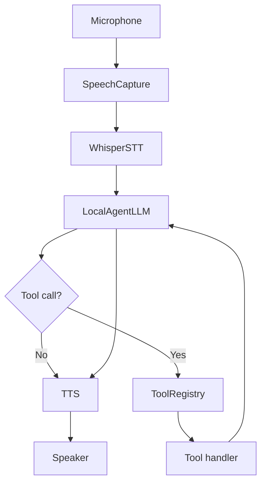
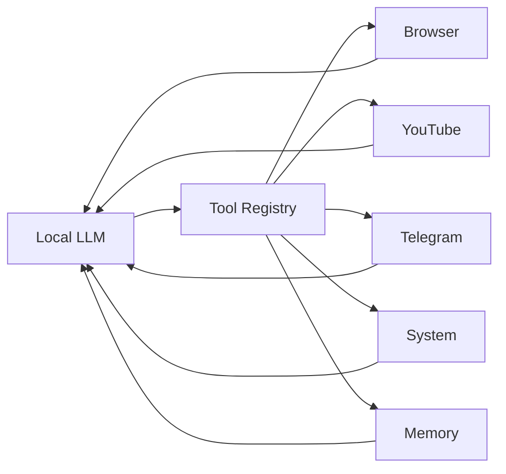

# ORBIT Architecture

ORBIT is intentionally split into small modules so students can trace the full agent data path without reading one monolithic file.

## Runtime data flow



## Main modules

### `main.py`

Composition root. It loads configuration, builds `VoiceAssistant`, builds `OrbitUI`, and starts the GUI loop.

### `assistant/audio.py`

Owns:

- microphone capture;
- chunking;
- simple RMS-based speech/silence detection;
- Whisper model loading;
- transcription.

### `assistant/llm.py`

Owns:

- Ollama client calls;
- system instructions;
- recent conversation context;
- tool-call loop;
- tool-result feedback;
- a deterministic spoken fallback when a model emits a tool call but no final prose;
- a research-integrity guard for failed web retrieval.

### `assistant/tool_registry.py`

Defines the permission / execution boundary between the model and Python functions.

The model does not receive arbitrary code execution. It only sees declared tool schemas.

### `assistant/tools_factory.py`

Registers concrete tools and injects configuration-specific handlers.

### `assistant/memory.py`

Stores explicit user-requested facts in local JSON. It is deliberately simple enough to inspect during the course.

### `assistant/orchestrator.py`

Coordinates the full voice lifecycle and ensures AI work does not block the GUI thread.

Default state path:

```text
LISTENING
→ TRANSCRIBING
→ THINKING
→ optional TOOL activity
→ SPEAKING
→ LISTENING
```

### `assistant/tts.py`

Provides local text-to-speech.

On Windows, the preferred path uses an interruptible SAPI subprocess. A pyttsx3 fallback is available.

## Audio interaction modes

### Half-duplex — default

The microphone is not open during TTS.

Advantages:

- reliable on ordinary laptop speakers;
- no self-trigger from the assistant's own voice;
- easy to explain and demo.

Manual speech interrupt is available through `F8`.

### Experimental barge-in

The codebase retains threshold-based barge-in for headphones or echo-cancelled audio paths.

It is not the recommended course default because amplitude thresholding alone cannot distinguish:

```text
real user speech
vs.
assistant audio leaking from the speaker into the microphone
```

Production full-duplex voice agents normally add acoustic echo cancellation and a dedicated voice-activity detector.

## Tool architecture



The important boundary is the registry: the model can request a declared action, but Python owns the actual execution.

## Web research

`research_web` separates **presentation** from **content extraction**:

1. search candidates are obtained;
2. the visible search page opens in the user's real browser;
3. selected source URLs are opened in visible tabs;
4. page text is fetched separately through HTTP;
5. readable text is returned to the local model for synthesis.

Opening exact source URLs is more robust than screen-coordinate clicking and survives browser zoom/theme/layout changes.

## Telegram Desktop

The Telegram tool deliberately demonstrates desktop automation:

```text
Windows Search
→ Telegram Desktop
→ search contact/chat
→ open first result
→ paste message
→ Enter
```

Clipboard paste is used for contact/message text so Persian/Unicode content is reliable.

`F8` is ORBIT's interrupt key. `Esc` is left available for Telegram navigation.

## Threading model

The Tk/CustomTkinter event loop must remain responsive.

Long-running work such as:

- microphone capture;
- Whisper transcription;
- model inference;
- web research;
- desktop automation;

runs away from the GUI event loop. UI state changes are passed back through events/callbacks.

## Design philosophy

The project optimizes for:

1. inspectability;
2. teaching value;
3. local execution where practical;
4. visible agent actions;
5. controlled tool permissions;
6. deterministic demos over maximum autonomy.
